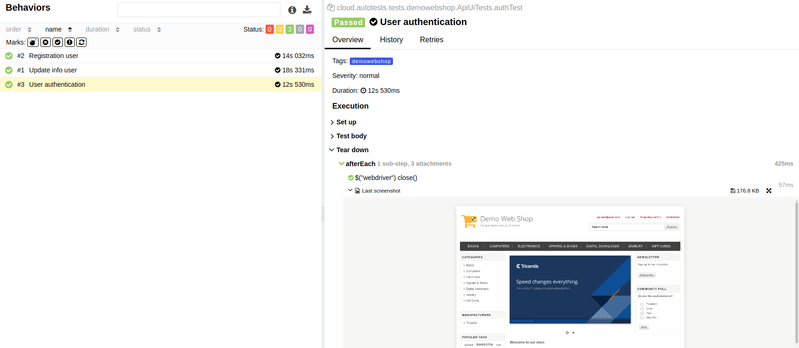
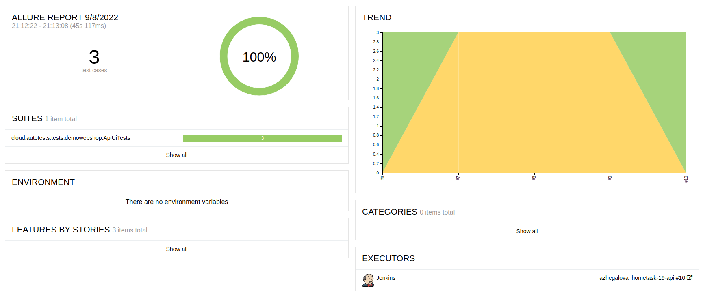
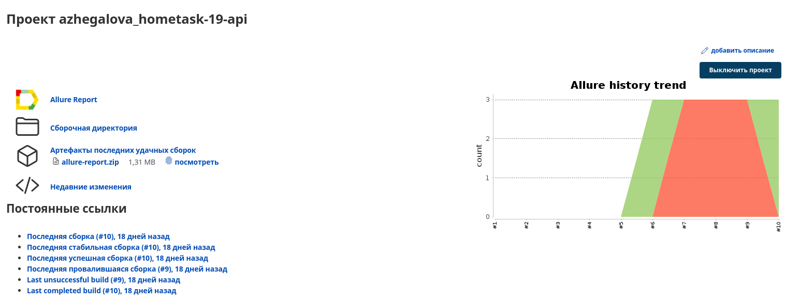

QA.GURU | Java | Автоматизация тестирования.

Тема задания:

REST API. Декомпозируем UI-тесты. Подключаем отчетность.

Задание:

* Добавить автотест на регистрацию пользователя и редактирование профиля пользователя c использованием API и проверками в UI, сайт магазина http://demowebshop.tricentis.com. 
* Добавить Allure и шаблоны для API (request.ftl и response.ftl).
* Добавить owner, jenkins, selenoid, все аттачменты для ui-тестов.

Ссылки на выполненное задание в:
* <a target="_blank" href="https://jenkins.autotests.cloud/job/azhegalova_hometask-19-api/"> Jenkins job.</a>

Скриншоты:

 

